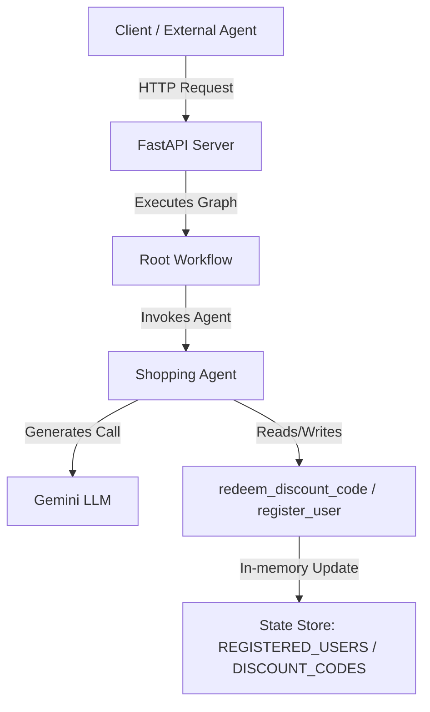

# STRIDE Threat Model Assessment: `shopping-assistant`

This document details the threat modeling assessment performed on the `shopping-assistant` agent graph and its supporting application architecture.

## 1. System Boundaries & Data Flows
The application consists of a FastAPI service ([fast_api_app.py](file:///Users/ayushk/Documents/GoogleIntAIAgentsPro/day4.1/secure-agent-lab/shopping-assistant/app/fast_api_app.py)) exposing an agent workflow ([agent.py](file:///Users/ayushk/Documents/GoogleIntAIAgentsPro/day4.1/secure-agent-lab/shopping-assistant/app/agent.py)) powered by Google GenAI (Gemini).

### Key Entry Points
*   **A2A Endpoint**: `/a2a/app` - Processes incoming agent-to-agent protocol requests.
*   **Feedback Endpoint**: `/feedback` - Collects telemetry feedback.
*   **LLM Tools**: `redeem_discount_code` and `register_user` functions invoked by the `shopping_agent` via Gemini function calling.

### Data Storage
*   **In-Memory State**: `REGISTERED_USERS` (Python `set`) and `DISCOUNT_CODES` (Python `dict`).

---

## 2. STRIDE Evaluation

### 👤 Spoofing (Identity Spoofing)
*   **Threat**: Any caller can supply an arbitrary `user_id` when interacting with the agent or triggering the `redeem_discount_code` tool. There is no verification that the user invoking the assistant actually owns the registered `user_id`.
*   **Severity**: **HIGH**
*   **Mitigation**:
    1. Bind the `user_id` to a verified session context (e.g., JWT token validated at the FastAPI middleware layer) instead of letting the LLM supply the `user_id` parameter to the tool.
    2. Pass authenticated user context as metadata in the run configuration.

### ✍️ Tampering (Data/Parameters Modification)
*   **Threat**: Attackers could exploit prompt injection to trick the LLM into calling `redeem_discount_code` or `register_user` with altered or malicious parameters (e.g. bypassing in-memory logic).
*   **Severity**: **MEDIUM**
*   **Mitigation**:
    1. Implement strict validation on input schemas using Pydantic (e.g., strict alphanumeric patterns for discount codes).
    2. Transition from local in-memory storage to a secure persistent database (like Cloud SQL or Firestore) with ACID transactions to prevent race conditions (double-redemption attacks).

### 📜 Repudiation (Denial of Action)
*   **Threat**: The system performs redemptions in-memory and lacks structured, cryptographically signed audit trails. If a discount code is fraudulently redeemed, the organization cannot prove which client or IP address initiated the request.
*   **Severity**: **LOW/MEDIUM**
*   **Mitigation**:
    1. Stream structured audit logs containing the verified session ID, caller IP, timestamp, and transaction result to Google Cloud Logging or BigQuery.
    2. Mark logs as immutable.

### ℹ️ Information Disclosure (Exposing Secrets/PII)
*   **Threats**:
    1. Prompt injection could induce the LLM to leak the system instruction prompt or disclose details of other user IDs and valid discount codes (`DISCOUNT_CODES`).
    2. Unhandled tool exceptions could leak raw Python stack traces to the LLM or to the end user via FastAPI response payloads.
*   **Severity**: **MEDIUM**
*   **Mitigation**:
    1. Do not hardcode lists of valid discount codes in Python memory if they are confidential; query them per-validation from a secure datastore.
    2. Implement exception-shielding middleware in FastAPI to intercept raw exceptions and return sanitized error messages.
    3. Strengthen LLM system instructions to explicitly refuse requests asking for administrative data.

### 💥 Denial of Service (System/Service Exhaustion)
*   **Threat**: The application does not rate-limit incoming HTTP calls. An attacker could flood the FastAPI endpoints, exhausting system resources and Gemini API quotas, leading to service denial and escalated Google Cloud costs.
*   **Severity**: **HIGH**
*   **Mitigation**:
    1. Implement rate-limiting middleware (such as `slowapi` or Redis-based rate limiters) on all exposed endpoints.
    2. Configure request timeouts and strict max token limits for Gemini LLM generations.

### 🔑 Elevation of Privilege (Unauthorised Access)
*   **Threat**: The FastAPI server exposes the `/a2a` routing paths without authentication or access control lists (ACLs). Any client that can reach the server can invoke the `shopping_assistant_workflow` and redeem/register users.
*   **Severity**: **HIGH**
*   **Mitigation**:
    1. Secure the FastAPI endpoints with authorization headers (e.g., Bearer tokens, OAuth2, or GCP IAM for A2A communication).
    2. Enforce role-based access control (RBAC) on the agent workflows.
